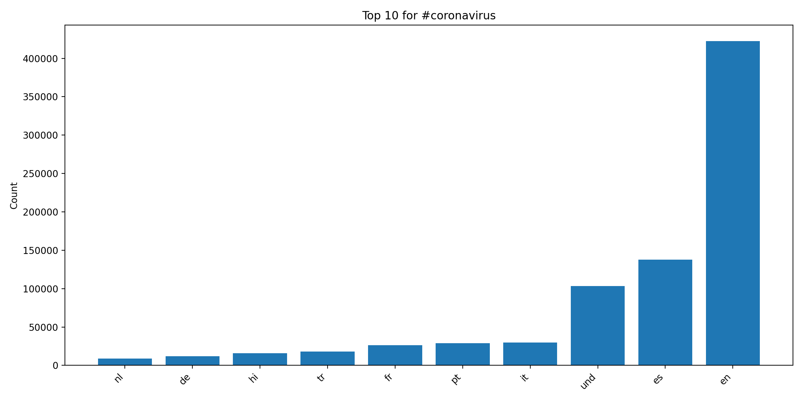
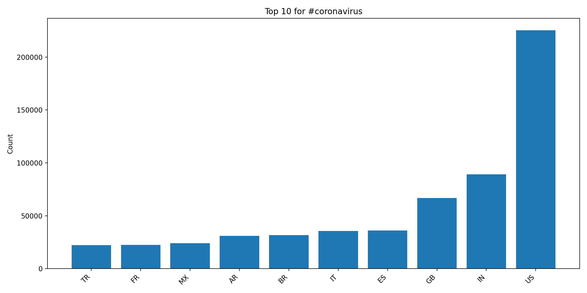
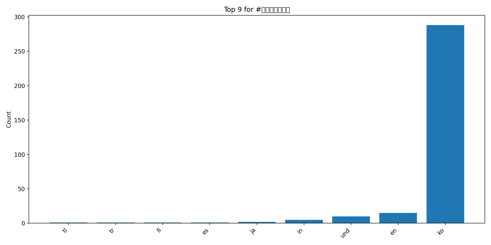
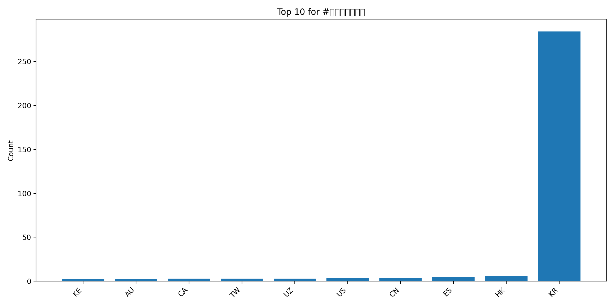
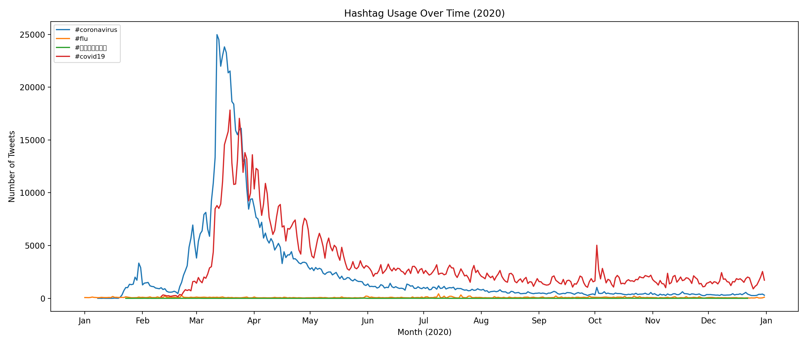

# Coronavirus Twitter Analysis

This project analyzes approximately 1.1 billion geotagged tweets from 2020 to track the spread of coronavirus-related hashtags across languages and countries using the MapReduce paradigm.

## Methods

- **Map**: Each day's zip file is processed in parallel by `src/map.py`, which counts hashtag usage broken down by language (`.lang`) and country (`.country`)
- **Reduce**: `src/reduce.py` combines all 366 daily output files into a single aggregated result
- **Visualize**: `src/visualize.py` generates bar charts of the top 10 languages/countries per hashtag
- **Alternative Reduce**: `src/alternative_reduce.py` generates a time series line plot of hashtag usage across the year

## Results

### #coronavirus by Language

### #coronavirus by Country

### #코로나바이러스 by Language

### #코로나바이러스 by Country

### Hashtag Usage Over Time

